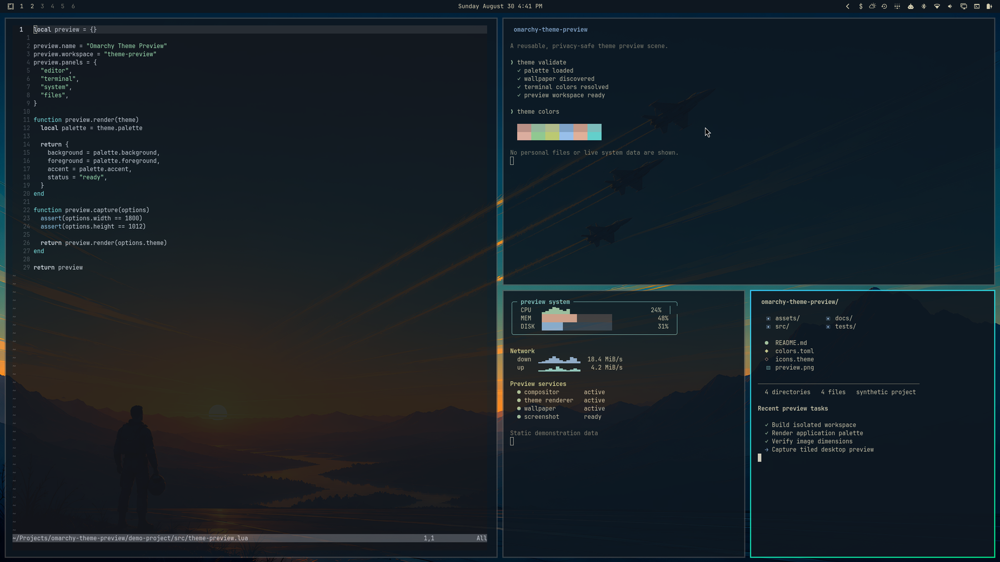

# Omalaunch Dusk for Omarchy

A cinematic Omarchy theme inspired by sunset aviation: deep naval surfaces, warm parchment text, powder blue, sage, cyan, and muted coral accents.



## Wallpapers

### Jets


### Rocket


## Install

```bash
omarchy theme install https://github.com/daniellemky/omarchy-omalaunch-dusk-theme.git
```

Omarchy derives the theme name `omalaunch-dusk` from the repository name and applies it automatically.

## Manual installation

```bash
git clone https://github.com/daniellemky/omarchy-omalaunch-dusk-theme.git \
  ~/.config/omarchy/themes/omalaunch-dusk
omarchy theme set omalaunch-dusk
```

## Palette

- Background: `#0e1720`
- Foreground: `#d5ceb1`
- Accent blue: `#8fb1d7`
- Green: `#a7c8a5`
- Cyan: `#8ecfca`
- Coral: `#d19c8d`

## Author

Created by [Daniel Lemky](https://github.com/daniellemky).

## License

MIT — see [LICENSE](LICENSE).
